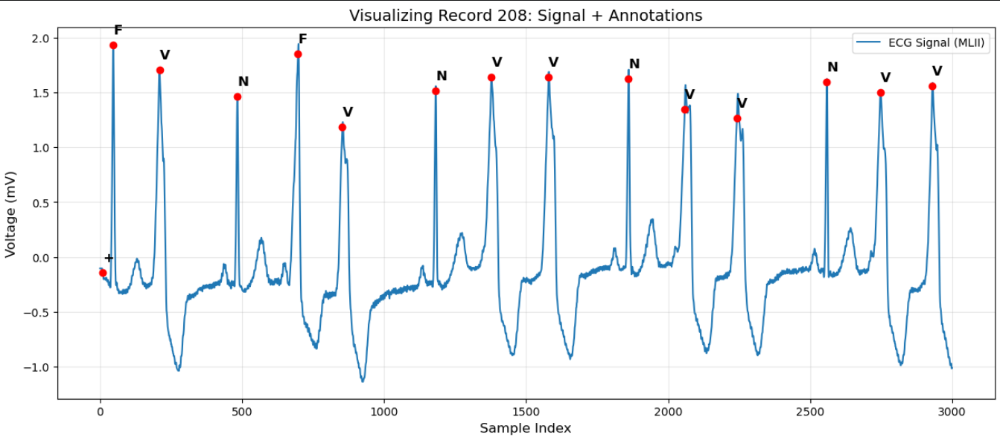

# Explainable Arrhythmia Detection With Wavelet Features for Intra-Patient and Inter-Patient ECG Classification
### Introduction
Early detection of arrhythmia is crucial in managing cardiac health in medicine. This is often done manually and on a beat-by-beat basis, thereby making real time monitoring in some critical cases signicantly challenging to human experts. In this project, we propose the use a decision tree(DT) machine learning model to classify and predict heart rhythms based on wavelet features for early diagnosis. This is particularly important due to the critical need for clinical interpretability and transparency required in medical diagnosis. While deep learning models have been shown to effectively analyse Electrocardiogram (ECG) signals, they also provide limited information to professionals on why they succeed or fail in most cases. Such blackbox models are particularly problematic in cardiology, where a diagnosis must be backed with physiological eveidence. So by crafting wavelet features from the signals to define their spectral properties at the different resolutions or decomposition levels, we aim to detect arrhythmia in heart rhythms with reasonable accuracy. The model is therefore trained to learn which features are relavant to detect what heart conditions, and which magnitudes can be set as permissible limits.

Another fundamental motivation for this approach is how beneficial their portability is in realtime, long-term monitoring of patients in resource constrained environements. Medical data are characteristcally very limited due to regulation and privacy rules, and the ML models are often deployed to live on low memory microchips. This makes the choice of DT models very attractive for medical devices, as they are basically deployed as sequence of if-and-else statements, and do not require massive data to train, unlike neural network based models.

To evaluate the model performance, results from two training scenarios are observed. One where some part of the patient's data is available during training (intra-patient mode). This is useful for models deployed online, where the they are continuously trained wih the data of the patient. A typical example would be in wearable devices, where they are personalised or customized to the user's specific ECG information. The other scenario is where the patient's data have been excluded from training entirely (inter-patient mode). This is often regarded as a more "realistic" setting or, in this case, the offline setting. In this case the model is trained as a one-size-fits all, where the model is trained only once on a given, and then applied to a various other samples that may not have been available during training.

In order to understand how much peformance gain or cost is achieved, the results are evaluated against two other classifiers namely logistic regression(LR) and XGBOOST(XGB). The results from the LR classifier provide a baseline performance to compare with our proposed DT model. This helps to highlight how much accuracy is gained by this choice while maintaining and even improving transparency with neglible tradeoff in portability. On the other hand, the XGB results provide the strong benchmark from blackbox models (XGBOOST), to also evaluate the performance cost of the proposed DT model where interpretability and portability is not a material constraint.

### Data Outline
For this project, the the MIT-BIH Arrhythmia Database was. This is a publicly available database used in medical research. It serves as benchmark for our experiment as it has been evaluated with various methods. The *<a href="https://archive.physionet.org/physiobank/database/html/mitdbdir/intro.htm">database</a>* contains heartbeats from a total of 48 patients recorded for 30 minutes each and  sampled at 360 Hz with 23 annotations. Following the Association for the Advancement of Medical Instrumentation (AAMI) standard, the 18 of the initial 23 annotations are further grouped into 5 categories of namely:
* Non-Ectopic(N) - Normal (N), Left/Right Bundle Branch Blocks (L, R), Atrial/Nodal Escapes (e, j).
* Supraventricular(S) - Atrial Premature (A), Aberrated (a), Nodal Premature (J), Supraventricular Premature (S).
* Ventricular(V) - Premature Ventricular Contraction (V), Ventricular Escape (E).
* Fusion(F) - Fusion of Ventricular and Normal (F).
* Unknown/Other(Q) - Paced (/), Fusion of Paced (f), Unclassifiable (Q).

### Feature Engineering and Extraction
An observation of the heartbeat signals reveal that while there is a global sinus rhythm, there are also local rhythms within the global structure. This is important as beats are often distinguished from one another by their magnigtudes, shapes and sequences within the signal segment. From the sample signal 208 plotted, the Normal(N) beats are characterised by sharp, slender, symmetric and regularly spaced between themselves. On the other hand, the Premature Ventricular Contraction(V) beats are characterized by wider, non-symmetric or skewed and irregularly spaced, while the Fusion(F) beats appear to have the highest magnitude within a sequence of beats. So by charaterizing each beat by parameters that define these features, we proceed to train a machine learning model to classify beats based on these features with reasonable accuracy.
<table>
  <tr>
    <td>
      
    </td>
    <td>
      
    </td>
  </tr>
</table>

The signal features can be defined by the randomness of the signal within a defined segment (entropy), the magnitude of a sample with respect to the neigbouring samples (relative energy), the shape of the segment (skewness), the |sharpness" or "bluntness" of a segment(kurtosis) and the difference between successive peaks (Pre_RR, Post_RR, RR_Ratio). This is where the wavelet transform is benefificial with its unique property of decomposing signals into different frequency bands while preserving their position in the sequence. This ensures that these signals are analysed at different fequency levels to capture their global and local properties effectively and evaluating which frequencies are the most discriminative in the describing a beat. 

**Sub-band Energy and Relative Power:**
The energy $E_j$ of a specific wavelet decomposition level $j$ is calculated as the sum of the squares of its coefficients:
$$E_j = \sum_{k=1}^{n} |C_{j,k}|^2$$

To capture the **Relative Energy** ($P_j$) or the percentage of power distribution across the frequency bands, we use:
$$P_j = \frac{E_j}{\sum E_{total}} \times 100\%$$

**Morphological Descriptors:**
To quantify the symmetry and sharpness of the QRS complex, we calculate the **Skewness** ($\gamma_1$) and **Kurtosis** ($\gamma_2$) of the wavelet coefficients at level $j$:

**Skewness (Asymmetry):**
$$\gamma_{1,j} = \frac{\frac{1}{n} \sum_{k=1}^{n} (C_{j,k} - \mu_j)^3}{\sigma_j^3}$$

**Kurtosis (Peakiness/Sharpness):**
$$\gamma_{2,j} = \frac{\frac{1}{n} \sum_{k=1}^{n} (C_{j,k} - \mu_j)^4}{\sigma_j^4}$$

*Where $\mu_j$ is the mean and $\sigma_j$ is the standard deviation of the coefficients $C_{j,k}$.*

**Shannon Entropy:**
The complexity of the signal within a specific sub-band is represented by Shannon Entropy ($H$):
$$H_j = -\sum_{k} p(C_{j,k}) \log_2 p(C_{j,k})$$

**Temporal (Rhythm) Features:**
The global rhythm is captured by analyzing the time intervals between successive R-peaks ($R_i$):

* **Pre-RR Interval:** $\Delta R_{pre} = R_i - R_{i-1}$
* **Post-RR Interval:** $\Delta R_{post} = R_{i+1} - R_i$
* **RR-Ratio:** $RR_{ratio} = \frac{\Delta R_{pre}}{\Delta R_{post}}$

#### DWT Frequency Band Calculation
The Discrete Wavelet Transform (DWT) decomposes the ECG signal $x[t]$ into a set of basis functions derived from a single Mother Wavelet $\psi(t)$. These basis functions, $\psi_{j,k}(t)$, are generated by scaling (dilating) and shifting (translating) the mother wavelet:

$$\psi_{j,k}(t) = 2^{-j/2} \psi(2^{-j}t - k)$$

Where:
* $j$ is the scale (decomposition level), determining the frequency band.
* $k$ is the translation (time shift), determining the position in the signal.

**Multi-Resolution Analysis (MRA)**
The DWT is implemented using a cascade of digital filters. The signal is simultaneously passed through a high-pass filter $g[n]$ and a low-pass filter $h[n]$. This results in the Detail and Approximation coefficients at each level $j$:

**Detail Coefficients (High Frequency):**
$$D_j[k] = \sum_{n} x[n] \cdot g[2k - n]$$

**Approximation Coefficients (Low Frequency):**
$$A_j[k] = \sum_{n} x[n] \cdot h[2k - n]$$
  
The frequency ranges for the decomposition levels are derived using Dyadic Decimation. Given a sampling frequency ($f_s$) of 360 Hz, the Nyquist frequency is $f_n = 180$ Hz. This 180 Hz represents the total bandwidth available for analysis.

## Decomposition Table: The Halving Process
| Level | Halving Logic (Remaining Bandwidth) | Frequency Range | Physiological Significance |
| :--- | :--- | :--- | :--- |
| **D1** | $180$ Hz $\div 2$ | 90 – 180 Hz | High-frequency Noise / Sharp Edges |
| **D2** | $90$ Hz $\div 2$ | 45 – 90 Hz | QRS Sharpness (R-peak tip) |
| **D3** | $45$ Hz $\div 2$ | 22.5 – 45 Hz | QRS Complex Main Body |
| **D4** | $22.5$ Hz $\div 2$ | 11.25 – 22.5 Hz | Wider Body |
| **A4** | Remaining Lower Half | 0 – 11.25 Hz | Baseline Wander / P & T Waves |